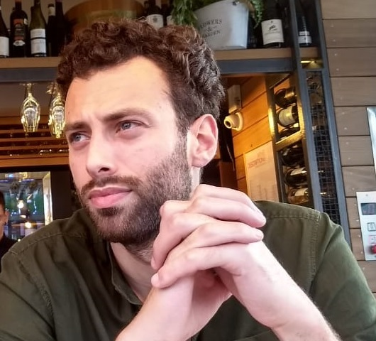

```{r setup, include=FALSE}
knitr::opts_chunk$set(echo = FALSE)
```

<style>
body {
  text-align: justify
}

h1 {
  text-align: center;
}

.aligncenter {
    text-align: center
}
</style>

<p class="aligncenter"></p>

I'm a doctoral researcher at the Institute of Cognitive Science, Osnabrück University, where I work on linguistic pragmatics drawing on psycholinguistic experimentation and cognitive modeling. In my PhD, I'm investigating the extent to which pragmatic language processing and production might be construed as a probabilistic and incremental process, i.e., as a form of Bayesian inferencing.

I’m broadly interested in the interplay between language, cognition, and social interaction. I'm particularly interested in issues related to [spontaneous] language use and language evolution, especially insofar as it pertains to sociopragmatic aspects of human communication such as repair, interactional structure, and intention recognition/ action formation and ascription. I also have an interest in [multi]modality and non-verbal communicative behavior.