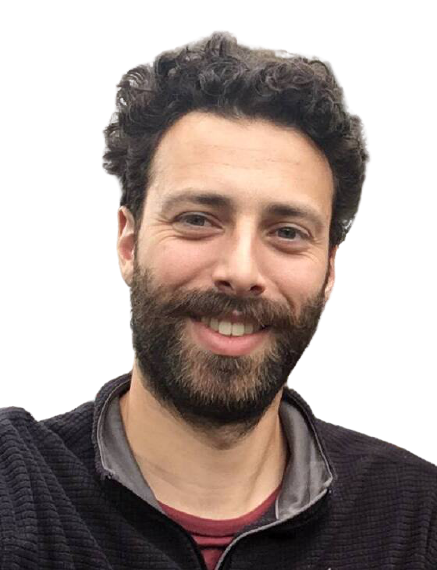

I'm a doctoral researcher in the [Cognitive Modeling group at the Institute of Cognitive Science](https://www.ikw.uni-osnabrueck.de/en/research_groups/cognitive_modeling/home.html), Osnabrück University, and in the [Semantics and Pragmatics group at the Leibniz-Centre General Linguistics (ZAS)](https://www.leibniz-zas.de/en/research/research-areas/semantics-pragmatics), where I work on linguistic pragmatics drawing primarily on experimental methods. In my PhD, supervised by [Michael Franke](http://www.home.uni-osnabrueck.de/michfranke/index.html), I'm investigating the extent to which pragmatic language processing might be construed in terms of expectation-based probabilistic inferencing.

I'm broadly interested in the interplay between language, cognition, and interaction, especially as it pertains to the construction and management of meaning in communication. In my research I try to explore how pressures from both individual cognition and communicative interaction shape the usage and organization of human language, e.g.:

* how different sorts of linguistic, semiotic, and contextual cues modulate people's discourse expectations and in turn affect their comprehension of language and their ascription of actions and mental states;

* how interactional aspects of human communication such as repair and turn-taking affect the emergence and evolution of linguistic meaning and structure in the first place.

I'm also interested in issues related to research design and methodology and data analysis.
